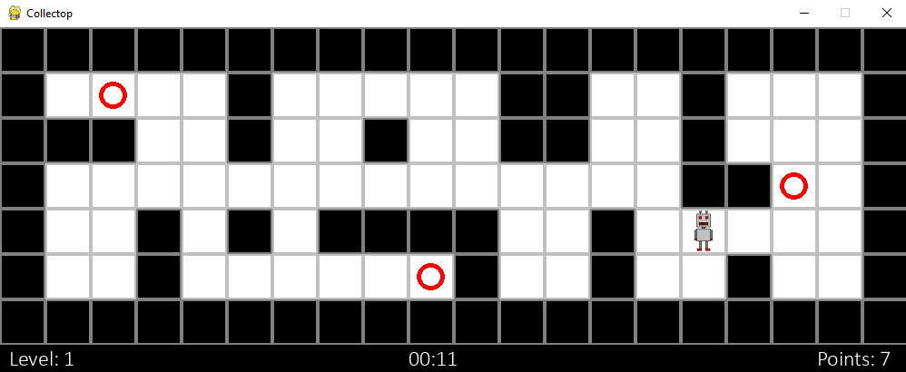

# Collectop

A simple game as the last exercise of a programming course. I decided to create a fun little game, where the player has to collect some rings in a short timeframe. You can find the course at https://programming-23.mooc.fi/, and the exercise https://programming-23.mooc.fi/part-14/4-your-own-game#quiz-8435be7f-180e-5d13-b693-306ddaeb45cd

Time needed from scratch: 1 day (5 hours)

## Installation

Download Collectop-main.zip and unpack to your desired file location. After that, run collectop.py on any console window.

## How to play

The game objective is to collect all of the red rings in a level before the time runs out. Each level has five rings and for every level passed, the sprite and the rings will be randomly generated in another place. For every ring you manage to collect, you get a point for it. The higher the level is, the less time you will have to collect all of the rings.

- Controls: up, down, right, left arrows (↑ ↓ → ←)

## Credits

All game images belong to mooc.fi.
